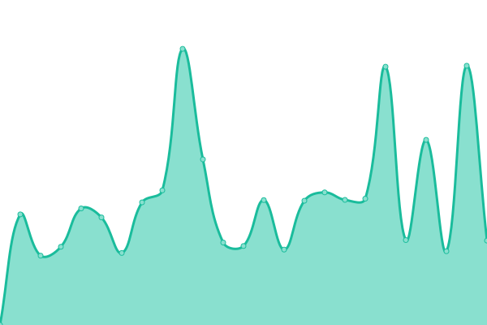

# [📈 Live Status](https://Kehpry.github.io/phishcheck): <!--live status--> **🟧 Partial outage**

This repository contains the open-source uptime monitor and status page for [Kehpry](https://Kehpry.github.io/phishcheck), powered by [Upptime](https://github.com/upptime/upptime).

With [Upptime](https://upptime.js.org), you can get your own unlimited and free uptime monitor and status page, powered entirely by a GitHub repository. We use [Issues](https://github.com/Kehpry/phishcheck/issues) as incident reports, [Actions](https://github.com/Kehpry/phishcheck/actions) as uptime monitors, and [Pages](https://Kehpry.github.io/phishcheck) for the status page.

<!--start: status pages-->
<!-- This summary is generated by Upptime (https://github.com/upptime/upptime) -->
<!-- Do not edit this manually, your changes will be overwritten -->
<!-- prettier-ignore -->
| URL | Status | History | Response Time | Uptime |
| --- | ------ | ------- | ------------- | ------ |
|  [www-dofus-mmorpg.fr](https://www-dofus-mmorpg.fr) | Accessible | [www-dofus-mmorpg-fr.yml](https://github.com/Kehpry/phishcheck/commits/HEAD/history/www-dofus-mmorpg-fr.yml) | 

 964ms
     
 | 

<a href="https://phishcheck.dofhelp.fr/history/www-dofus-mmorpg-fr">100.00%</a>
    

|  [Site test inaccessible](https://lutabox.xyz) | Inaccessible | [site-test-inaccessible.yml](https://github.com/Kehpry/phishcheck/commits/HEAD/history/site-test-inaccessible.yml) | 

 0ms
     
 | 

<a href="https://phishcheck.dofhelp.fr/history/site-test-inaccessible">14.46%</a>
    

<!--end: status pages-->

[**Visit our status website →**](https://Kehpry.github.io/phishcheck)

## 📄 License

- Powered by: [Upptime](https://github.com/upptime/upptime)
- Code: [MIT](./LICENSE) © [Kehpry](https://Kehpry.github.io/phishcheck)
- Data in the `./history` directory: [Open Database License](https://opendatacommons.org/licenses/odbl/1-0/)
