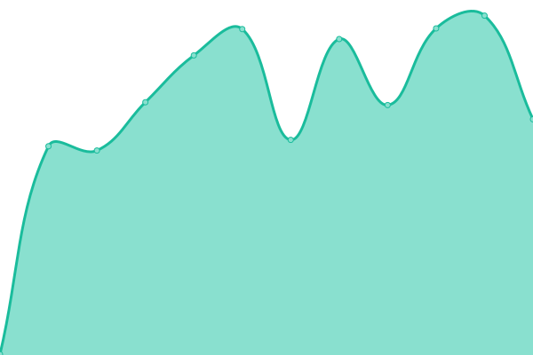

# [📈 Live Status](https://Kehpry.github.io/phishcheck): <!--live status--> **Tous les sites sont accessibles**

This repository contains the open-source uptime monitor and status page for [Kehpry](https://Kehpry.github.io/phishcheck), powered by [Upptime](https://github.com/upptime/upptime).

With [Upptime](https://upptime.js.org), you can get your own unlimited and free uptime monitor and status page, powered entirely by a GitHub repository. We use [Issues](https://github.com/Kehpry/phishcheck/issues) as incident reports, [Actions](https://github.com/Kehpry/phishcheck/actions) as uptime monitors, and [Pages](https://Kehpry.github.io/phishcheck) for the status page.

<!--start: status pages-->
<!-- This summary is generated by Upptime (https://github.com/upptime/upptime) -->
<!-- Do not edit this manually, your changes will be overwritten -->
<!-- prettier-ignore -->
| URL | Status | History | Response Time | Uptime |
| --- | ------ | ------- | ------------- | ------ |
|  [forum-dofus.com.co](http://forum-dofus.com.co/) | Accessible | [forum-dofus-com-co.yml](https://github.com/Kehpry/phishcheck/commits/HEAD/history/forum-dofus-com-co.yml) | 

 340ms
     
 | 

<a href="https://phishcheck.dofhelp.fr/history/forum-dofus-com-co">100.00%</a>
    

|  [dofus-events.com](https://dofus-events.com/) | Accessible | [dofus-events-com.yml](https://github.com/Kehpry/phishcheck/commits/HEAD/history/dofus-events-com.yml) | 

 936ms
     
 | 

<a href="https://phishcheck.dofhelp.fr/history/dofus-events-com">100.00%</a>
    

|  [succes-dofus.com](https://succes-dofus.com/) | Accessible | [succes-dofus-com.yml](https://github.com/Kehpry/phishcheck/commits/HEAD/history/succes-dofus-com.yml) | 

 1240ms
     
 | 

<a href="https://phishcheck.dofhelp.fr/history/succes-dofus-com">100.00%</a>
    

|  [ankama-gain.com](https://ankama-gain.com/) | Accessible | [ankama-gain-com.yml](https://github.com/Kehpry/phishcheck/commits/HEAD/history/ankama-gain-com.yml) | 

 428ms
     
 | 

<a href="https://phishcheck.dofhelp.fr/history/ankama-gain-com">100.00%</a>
    

|  [ankama-boutiques.com](https://ankama-boutiques.com/) | Accessible | [ankama-boutiques-com.yml](https://github.com/Kehpry/phishcheck/commits/HEAD/history/ankama-boutiques-com.yml) | 

 436ms
     
 | 

<a href="https://phishcheck.dofhelp.fr/history/ankama-boutiques-com">100.00%</a>
    

|  [ankama.store](https://ankama.store/) | Accessible | [ankama-store.yml](https://github.com/Kehpry/phishcheck/commits/HEAD/history/ankama-store.yml) | 

 485ms
     
 | 

<a href="https://phishcheck.dofhelp.fr/history/ankama-store">100.00%</a>
    

<!--end: status pages-->

[**Visit our status website →**](https://Kehpry.github.io/phishcheck)

## 📄 License

- Powered by: [Upptime](https://github.com/upptime/upptime)
- Code: [MIT](./LICENSE) © [Kehpry](https://Kehpry.github.io/phishcheck)
- Data in the `./history` directory: [Open Database License](https://opendatacommons.org/licenses/odbl/1-0/)
